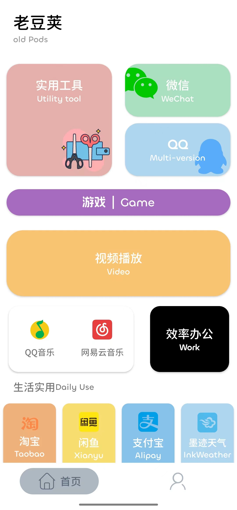

#   oldPods v3.0

  

专注于旧版应用的一款APP，分享轻应用

目前支持版本Android 4.0.3至Android 13

> [!WARNING]
> 在Android 13中在启动oldPods APP时 开启/关闭 系统级 亮色/暗色 模式 会出现卡顿或闪退情况。

**v3.0 更新内容**
- 重置主页面，将主页面控件全部替换为本地原生控件
- 增加部分控件的动画效果
- 部分控件增加二级菜单
- 增加”我的“页面，将下载入口转移至”我的“页面中
- 设置页面中增加自选权限获取功能
- 增加夜间功能

**v3.0 Bug修复**
- 修复Android 14下载无法自动安装问题
- 修复Android 5.1无法进入app/app闪退情况
- 修复Android 4.3、4.2在app中无法点击链接情况

